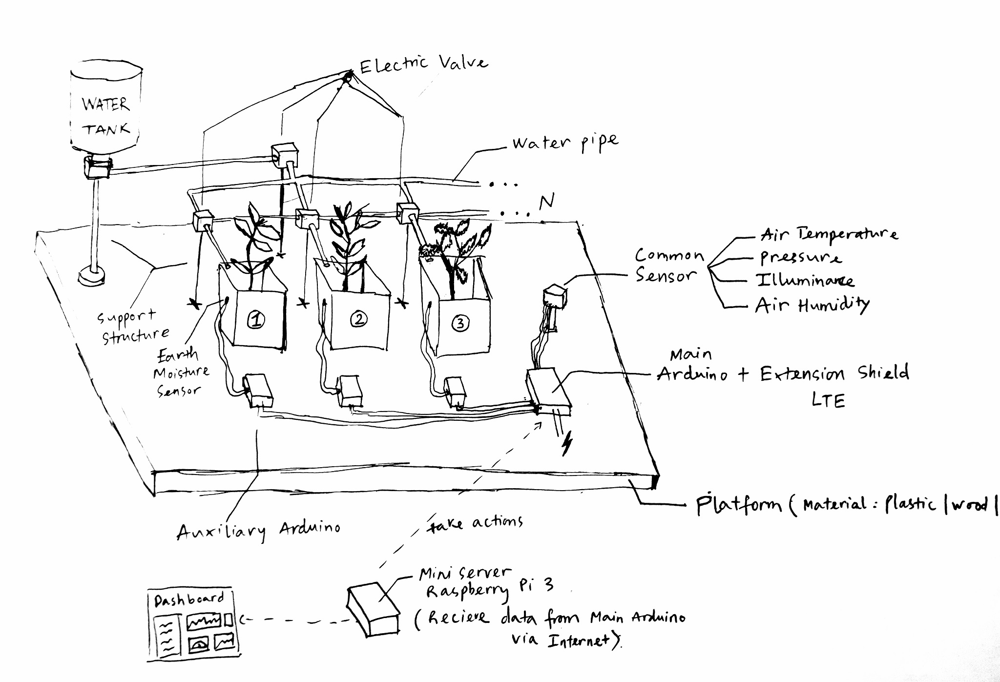

# **Smart Garden System API**

*Provides Smart Garden controlling and monitoring APIs for 3rd-party system*

---
**Table of content**
1. Summary
2. Architecture
3. Implementation
4. APIs document
---
## 1. Summary
Internet of Things (IoT) in agriculture application is a hot trend topic nowadays. To help student know more about IoT and how their apps, which was built in various technologies, interact with IoT system, DSC of Hoa Sen University decided to build an IoT Garden Model.

The IoT Garden Model will provide full monitoring and controlling methods so that students can connect to easily...

Here is the IoT Garden Model in concept

||
|---------|
| IoT Garden Model in concept|

## 2. Architecture

