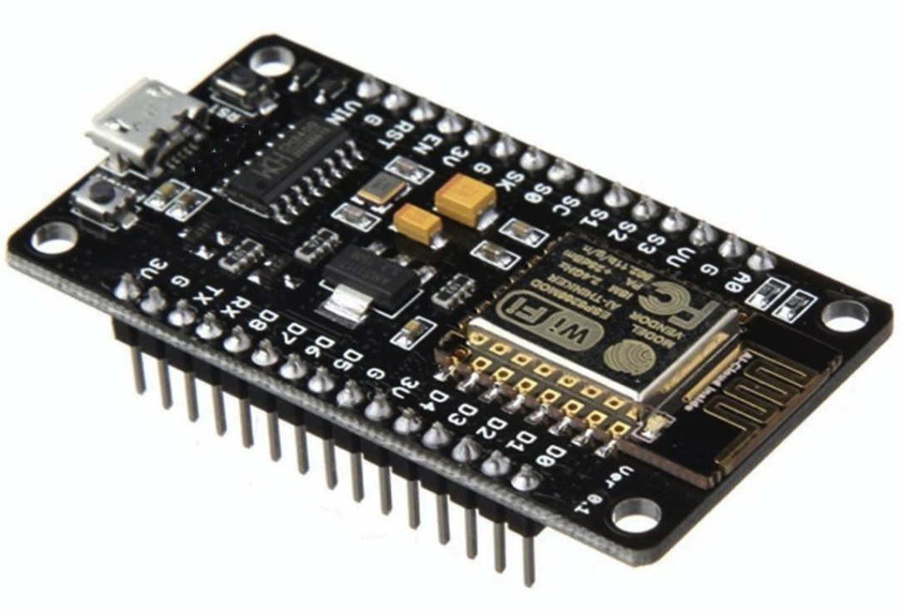
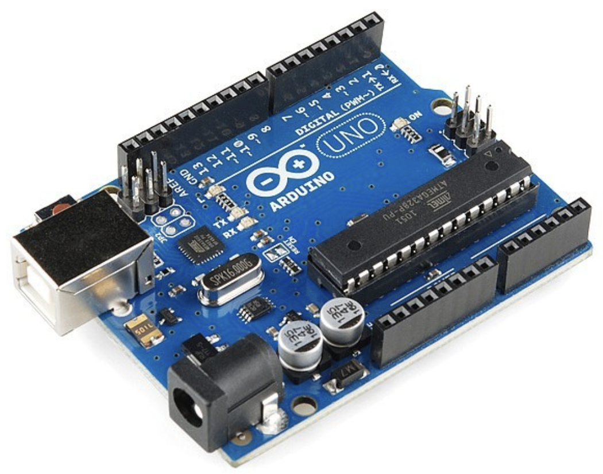

# **Arduino Installation**
*Adding Library for ESP8266 in Arduino*

---
**Table of content**
1. Hardware
2. Installation
2. Source code
4. Diagram
---
## 1. Hardware
In the demo we using the ESP8266 running Arduino software. If you are using Arduino UNO or any Arduino base platform you don't need to install additional ESP8266 Library.

||
|---------|
| ESP8266|

||
|---------|
| Arduino UNO|

## 2. Installation
## For window and UNIX
Go to https://www.arduino.cc/en/Main/Software to dowload the lastest arudino software
## For the ESP8266
Install additional library in Arduino swoftware to use on the ESP8266 the how to located here  https://randomnerdtutorials.com/how-to-install-esp8266-board-arduino-ide/

